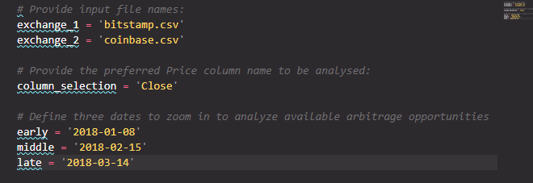

# Bitcoin Arbitrage

### As many assets trade on different exchanges across the globe, there might be instances of the simultaneous price dislocations in those exchanges. <br /> Crypto Arbitrage application provides a comprehencive framework for the three phases of financial analysis to determine if any arbitrage exists for a selected asset.

---

## 

---

## Table of contents

1. [Technologies](#technologies)
2. [Installation Guide](#installation-guide)
3. [Usage](#usage)
4. [Contributors](#contributors)
5. [License](#license)

---

## Technologies

`Python 3.9`

`Jupyter lab`

_Prerequisites_

pandas is a Python package that provides fast, flexible, and expressive data structures designed to make working with large sets of data easy and intuitive

- [pandas](https://github.com/pandas-dev/pandas) - For the documentation, installation guide and dependencies.
- [matplotlib ](https://matplotlib.org/) - For guidance on how to start visualization, interactive visualization, styles and layouts customazation.

---

## Installation Guide

Jupyter lab is a preferred software to work with Crypto Arbitrage application.<br/> Jupyter lab is a part of the **[anaconda](https://www.anaconda.com/)** distribution package and therefore it is recommended to download **anaconda** first.<br/> Once dowloaded, run the following command in your terminal to lauch Jupyter lab:

```python
jupyter lab
```

Before using the application first install the following dependencies by using your terminal:

To install pandas run:

```python
#  PuPi
pip install pandas
```

```python
# or conda
conda install pandas
```

---

## Usage

> Application summary<br/>

Crypto Arbitrage application takes you through the three stages of data analysis:

- data collection
- preparation of data
- analysing the data
  <br/>

At the end of the analysis the arbitrage opportunities for selected dates are analysed and quantified. Finally a report summarizing the findings is produced. <br/>

> Getting started<br/>

- To use Crypto Arbitrage application first clone the repository to your PC. The repository comes with **crypto_arbitrage.ipynb** application, as well as `static_data.py` for analysis customization and a sample of data files covering BTC price data on Coinbase and Bitstamp observed during Q1 2018. <br/>
- Open `Jupyter lab` as per the instructions in the [Installation Guide](#installation-guide) to run the application.<br/>
- Next, save your data files in the **Resources/** directory.<br/>
- Open `static_data.py` in your text editor and:
  - Provide file names for your analysis
  - Additional customization options include the selection of the Price Column and specific dates for analyzes.



<br/> At the very end of the application you can find a report drawn based on the data set and the above selections. It can serve as a sample for your analysis and final report .

---

## Contributors

Contact Details:

Boris Dudkin:

- [Email](boris.dudkin@gmail.com)
- [LinkedIn](www.linkedin.com/in/Boris-Dudkin)

---

## License

MIT
